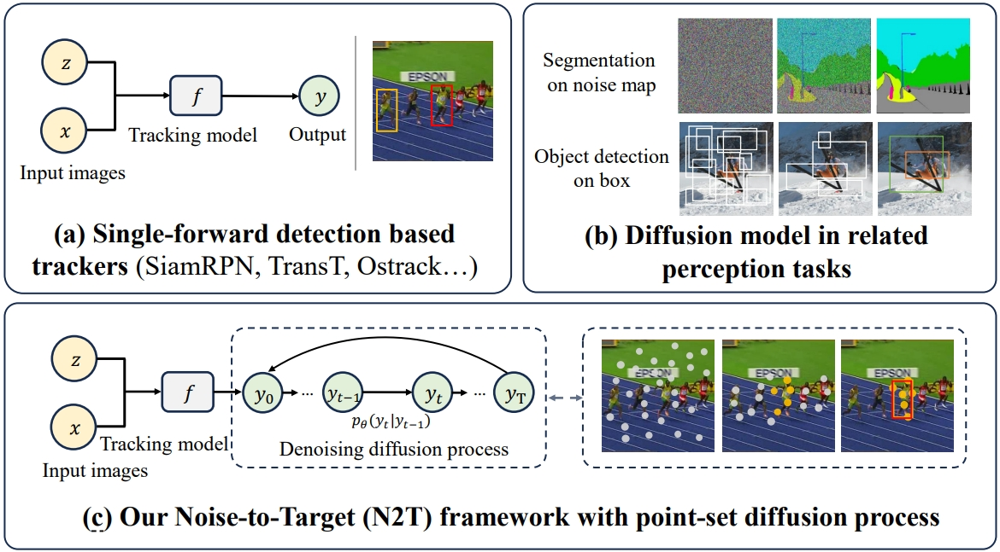

# DiffusionTrack

## DiffusionTrack: Point Set Diffusion Model for Object Tracking and Segmentation

### :star: Our paper is accepted by CVPR2024! Code and paper will be released!

```bibtex
Fei Xie, Zhongdao Wang, Chao Ma 
```
## Highlights


Compared to detection-based trackers with a single forward evaluation scheme (a), e.g., SiamRPN, TransT, OStrack~\cite{ostrack}, our proposed DiffusionTrack (c) localizes the target in a progressive diffusion manner. Furthermore, we tailor a point set representation to model the target object for the tracking task instead of adopting existing representations such as noise maps for segmentation and random boxes for object detection. 


## Abstract
Existing Siamese or transformer trackers commonly pose visual object tracking as a one-shot detection problem, i.e., locating the target object in a \textbf{single forward evaluation} scheme. Despite the demonstrated success, these trackers may easily drift towards distractors with similar appearance due to the single forward evaluation scheme lacking self-correction. To address this issue, we cast visual tracking as a point set based denoising diffusion process and propose a novel generative learning based tracker, dubbed DiffusionTrack. Our DiffusionTrack possesses two appealing properties: 1) It follows a novel noise-to-target tracking paradigm that leverages \textbf{multiple} denoising diffusion steps to localize the target in a dynamic searching manner per frame. 2) It models the diffusion process using a point set representation, which can better handle appearance variations for more precise localization. One side benefit is that DiffusionTrack greatly simplifies the post-processing, e.g., removing the window penalty scheme. Without bells and whistles, our DiffusionTrack achieves leading performance over the state-of-the-art trackers and runs in real-time.


## Citing DiffusionTrack
If you find DiffusionTrack useful in your research, please consider citing:

```

